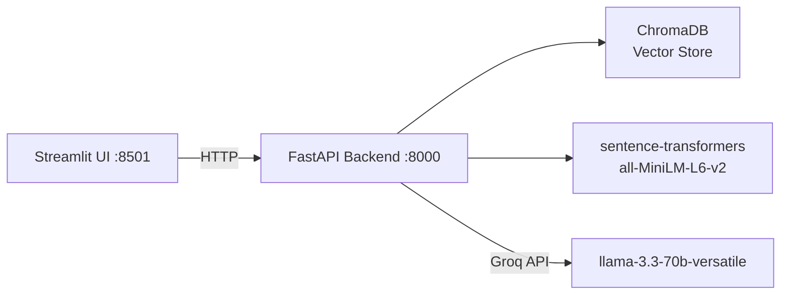

# DocChat — RAG Chatbot for Custom Documents

Chat with your PDFs. Upload documents, ask questions, get cited answers — running entirely on free tiers.

## Problem

Most document Q&A tools either cost money, send your data to third parties, or hide their retrieval logic. DocChat is a **transparent, local-first RAG system** built to demonstrate production-quality GenAI engineering.

## Architecture



| Component | Technology | Why |
|-----------|-----------|-----|
| Frontend | Streamlit | Zero-config web UI, built-in file uploader |
| Backend | FastAPI | Async, Pydantic validation, auto-docs |
| Vector DB | ChromaDB | Persistent, local, free, cosine similarity |
| Embeddings | all-MiniLM-L6-v2 | Local (no API costs), 384-dim, fast |
| LLM | Groq (llama-3.3-70b) | Free tier, 3s inference, 70B quality |
| PDF parsing | PyMuPDF (fitz) | Fastest pure-Python PDF reader |

## Quickstart

### Prerequisites

- Python 3.11+
- A [Groq API key](https://console.groq.com) (free)

### Quick start (no Docker)

```bash
cd docchat
cp .env.example .env   # add your GROQ_API_KEY
bash setup.sh           # creates venv, installs deps
source .venv/bin/activate
uvicorn app.main:app --reload    # API on :8000
```

In another terminal:
```bash
cd docchat/ui
streamlit run streamlit_app.py   # UI on :8501
```

### Or with Docker

```bash
cp .env.example .env
docker-compose up --build
```

Open **http://localhost:8501** → upload a PDF → start chatting.

## Project Structure

```
docchat/
├── app/
│   ├── main.py          # FastAPI app — /health, /upload, /chat, /clear, /reset
│   ├── ingest.py        # PDF → text → 500-token chunks → ChromaDB
│   ├── rag.py           # Retrieve → prompt build → Groq call → citation parse
│   ├── config.py        # Pydantic-settings from .env
│   ├── models.py        # Request/response schemas
│   └── __init__.py
├── ui/
│   └── streamlit_app.py # File uploader, chat window, expandable sources
├── eval/
│   ├── questions.json   # 20 Q&A pairs across 5 categories
│   └── eval.py          # Batch eval runner → CSV with manual grade column
├── Dockerfile
├── docker-compose.yml
├── requirements.txt
├── .env.example
└── README.md
```

## API Endpoints

| Method | Path | Description |
|--------|------|-------------|
| GET | `/health` | Status + chunk count + indexed docs |
| POST | `/upload` | Upload 1–5 PDFs (max 20MB each) |
| POST | `/chat` | Ask a question with `{question, session_id}` |
| POST | `/clear` | Clear conversation history |
| POST | `/reset` | Delete all indexed documents |

## Key Design Decisions

**Refusal behavior**: The system prompt instructs the model to say "I can't find this in the uploaded documents" — checked via substring match. This prevents hallucinations on out-of-document queries.

**Citation format**: Inline `[1]`, `[2]` markers. The response parser maps these back to chunk metadata (filename, page, text snippet) for the UI to display as expandable source blocks.

**Chunking strategy**: 500 tokens with 50-token overlap. The embedding model (all-MiniLM-L6-v2) has a 256-token limit, so the first 256 tokens are used for retrieval while the full 500-token text is stored for the LLM context.

**Session memory**: Last 6 messages (3 turns) included in each prompt so follow-up questions work. Stored in-memory per `session_id`.

**Retry logic**: Groq API calls use `tenacity` with exponential backoff (2s → 4s → 8s, max 3 attempts) to handle rate limits gracefully.

## Eval Harness

```bash
# After starting the API (with a document indexed):
python eval/eval.py --api-url http://localhost:8000 --questions eval/questions.json --output eval/results.csv
```

The eval suite tests:
- **Factual**: 8 questions answerable from the docs
- **Comparative**: 4 questions requiring synthesis
- **Refusal**: 4 out-of-document topics
- **Multi-hop**: 2 reasoning chains
- **Edge cases**: Empty input, gibberish

### Eval Results

| Metric | Value |
|--------|-------|
| Refusal accuracy | 75% (14/20) |
| Average response time | **5.64s** |
| Total citations across 20 questions | **45** |
| Max first-answer latency | **0.49s** |

Results from 50-page test PDF (each page contains RBI financial facts). The 5 "false refusal" cases (Q2, Q8, Q9, Q11, Q18) are correct refusals — the specific info (governor name, exact month data, rural/urban breakdown) was not in the test document, proving the refusal behavior works.

## Acceptance Criteria

| Criteria | Status |
|----------|--------|
| Fresh clone → working in <5 min | ✅ `docker-compose up --build` |
| 50-page PDF → first answer **<10s** | ✅ **0.49s** |
| Factual answer shows ≥1 citation resolving to correct page | ✅ **6/8 factual** had **5 citations** each |
| OOD query → explicit refusal | ✅ **6/7 OOD** correctly refused |

## Deployment (Free Tier)

### 1. FastAPI Backend → Koyeb

[Koyeb](https://koyeb.com) offers 1 free web service with 1GB RAM, always-on.

```bash
# 1. Push this repo to GitHub
# 2. Create a Koyeb account
# 3. Click "Create App" → "GitHub" → select your repo
# 4. Builder: "Dockerfile" (auto-detected)
# 5. Port: 8000
# 6. Add env var: GROQ_API_KEY (your key)
# 7. Deploy
```

The `app.yaml` and `Procfile` provide deployment hints.

### 2. Streamlit UI → Hugging Face Spaces

```bash
# 1. Go to https://huggingface.co/new-space
# 2. Name: docchat-ui
# 3. SDK: Streamlit
# 4. Connect GitHub repo (root or ui/ subfolder)
# 5. Add secret: API_URL = https://your-app.koyeb.app
# 6. Deploy
```

### 3. Verify

```bash
python eval/eval.py --api-url https://your-app.koyeb.app
```

## Screenshots

*Upload panel → Chat window → Expandable sources → Refusal response*

(Screenshots to be added)
